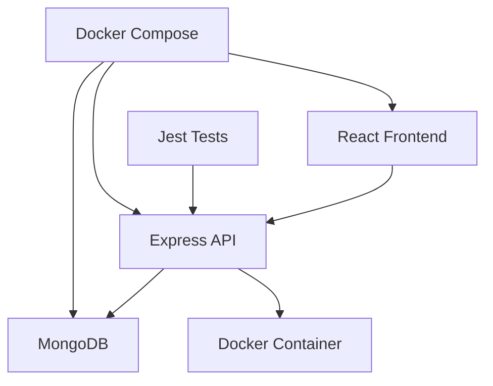

# 🎯 Microservice Gestion de Compétences

> Système de suivi et d'évaluation des compétences professionnelles avec architecture MERN moderne

[](https://nodejs.org/)
[](https://www.mongodb.com/)
[](https://reactjs.org/)
[](https://www.docker.com/)
[](https://jestjs.io/)
[](LICENSE)

## 📋 Table des Matières

- [🎯 Aperçu](#-aperçu)
- [✨ Fonctionnalités](#-fonctionnalités)
- [🏗️ Architecture](#️-architecture)
- [🚀 Installation](#-installation)
- [💻 Utilisation](#-utilisation)
- [📊 API Documentation](#-api-documentation)
- [🧪 Tests](#-tests)
- [🐳 Docker](#-docker)
- [🛠️ Technologies](#️-technologies)
- [🤝 Contribution](#-contribution)
- [📄 License](#-license)

## 🎯 Aperçu

Ce microservice permet de gérer et d'évaluer les compétences professionnelles (C1 à C8) et leurs sous-compétences associées. Développé pour **Équipe Med**, il s'intègre dans une plateforme plus large de suivi des formations internes.

### 📊 Logique d'Évaluation
Une compétence est **validée** si : `sous-compétences validées ≥ sous-compétences non validées`

### 🎨 Démonstration
```bash
# Démarrage rapide avec Docker
docker-compose up -d

# Interface disponible sur http://localhost:3000
# API disponible sur http://localhost:5000/api
```

## ✨ Fonctionnalités

### 🔧 Backend
- ✅ **API RESTful** complète (CRUD)
- ✅ **Validation automatique** des compétences
- ✅ **Programmation moderne** ES6+ (async/await, destructuring, spread)
- ✅ **Fonctions de haut niveau** (map, filter, reduce)
- ✅ **Base de données** MongoDB avec Mongoose
- ✅ **Tests unitaires** et d'intégration Jest
- ✅ **Conteneurisation** Docker complète

### 🎨 Frontend
- ✅ **Interface responsive** React moderne
- ✅ **Design UX/UI** intuitif
- ✅ **Gestion temps réel** des statuts
- ✅ **Responsive Design** mobile-first
- ✅ **Animations CSS3** fluides

## 🏗️ Architecture



### 📁 Structure Projet
```
gestion-de-competences/
├── 📁 backend/              # API Node.js + Express
│   ├── config/              # Configuration globale
│   │   ├── db.js            # Connexion MongoDB
│   │   └── env.js           # Variables d'environnement
│   ├── controllers/         # Logique métier
│   │   └── competenceController.js  # CRUD + calcul statut
│   ├── models/              # Schémas Mongoose
│   │   └── Competence.js    # Modèle Compétence + sous-compétences
│   ├── routes/              # Définition des endpoints
│   │   └── competenceRoutes.js  # Routes RESTful
│   ├── middlewares/         # Middlewares personnalisés
│   │   ├── errorHandler.js  # Gestion centralisée des erreurs
│   │   └── validate.js      # Validation des données
│   ├── services/            # Services métier
│   │   └── statusService.js # Calcul statut global (reduce)
│   ├── utils/               # Utilitaires
│   │   ├── hofUtils.js      # Fonctions map/filter/reduce
│   │   └── logger.js        # Logging structuré
│   ├── tests/               # Tests Jest
│   │   ├── unit/            # Tests unitaires
│   │   └── integration/     # Tests d'intégration
│   ├── server.js            # Point d'entrée
│   ├── Dockerfile           # Configuration Docker
│   └── package.json         # Dépendances + scripts
├── 📁 frontend/             # Application React
│   ├── src/
│   │   ├── components/      # Composants React
│   │   ├── services/        # Services API
│   │   ├── hooks/           # Hooks personnalisés
│   │   └── styles/          # CSS3 & Responsive
└── 📁 docker/               # Configuration Docker Compose
```

## 🚀 Installation

### 📋 Prérequis
- **Node.js** 18.0+ 
- **MongoDB** 6.0+
- **Docker** & Docker Compose (optionnel)
- **Git**

### ⚡ Installation Rapide

```bash
# 1. Cloner le repository
git clone https://github.com/med-more/gestion-de-comp-tences.git
cd gestion-de-competences

# 2. Installation avec Docker (Recommandé)
docker-compose up -d

# 3. Ou installation manuelle
npm run install:all
npm run dev
```

### 🔧 Installation Manuelle

```bash
# Backend
cd backend
npm install
cp .env.example .env
npm run dev

# Frontend (nouveau terminal)
cd frontend
npm install
npm start
```

### ⚙️ Variables d'Environnement

```bash
# backend/.env
NODE_ENV=development
PORT=5000
MONGODB_URI=mongodb://localhost:27017/competences
JWT_SECRET=your-super-secret-key
CORS_ORIGIN=http://localhost:3000
```

## 💻 Utilisation

### 🎯 Interface Utilisateur
1. **Accéder à l'application** : `http://localhost:3000`
2. **Créer une compétence** : Cliquer sur "Nouvelle Compétence"
3. **Gérer les sous-compétences** : Ajouter/modifier/supprimer
4. **Visualiser le statut** : Statut calculé automatiquement

### 📊 Exemple de Compétence
```json
{
  "code": "C1",
  "nom": "Développement Frontend",
  "sousCompetences": [
    {
      "nom": "HTML5 Sémantique",
      "statut": "validée"
    },
    {
      "nom": "CSS3 Avancé",
      "statut": "non validée"
    },
    {
      "nom": "JavaScript ES6+",
      "statut": "validée"
    }
  ],
  "statutGlobal": "validée"
}
```

## 📊 API Documentation

### 🔗 Endpoints Principaux

| Méthode | Endpoint | Description |
|---------|----------|-------------|
| `GET` | `/api/competences` | Liste toutes les compétences |
| `POST` | `/api/competences` | Crée une nouvelle compétence |
| `GET` | `/api/competences/:id` | Récupère une compétence |
| `PUT` | `/api/competences/:id/evaluation` | Met à jour l'évaluation |
| `DELETE` | `/api/competences/:id` | Supprime une compétence |

### 📝 Exemples d'Utilisation

#### Créer une Compétence
```bash
curl -X POST http://localhost:5000/api/competences \
  -H "Content-Type: application/json" \
  -d '{
    "code": "C1",
    "nom": "Développement Frontend",
    "sousCompetences": [
      {"nom": "HTML5", "statut": "validée"},
      {"nom": "CSS3", "statut": "non validée"}
    ]
  }'
```

#### Mettre à Jour l'Évaluation
```bash
curl -X PUT http://localhost:5000/api/competences/:id/evaluation \
  -H "Content-Type: application/json" \
  -d '{
    "sousCompetences": [
      {"nom": "HTML5", "statut": "validée"},
      {"nom": "CSS3", "statut": "validée"}
    ]
  }'
```


## 🧪 Tests

### 🎯 Couverture de Tests
- ✅ **Tests unitaires** : Modèles, Controllers, Utilitaires
- ✅ **Tests d'intégration** : Routes API
- ✅ **Tests Frontend** : Composants React
- ✅ **Tests HOF** : Fonctions de haut niveau

### 🚀 Exécution des Tests

```bash
# Tests Backend
cd backend
npm test                    # Tests unitaires
npm run test:integration    # Tests d'intégration
npm run test:coverage      # Coverage report

# Tests Frontend
cd frontend
npm test                   # Tests composants React
npm run test:coverage     # Coverage report

# Tests complets
npm run test:all          # Tous les tests
```

### 🧪 Exemple de Test HOF
```javascript
// tests/unit/hofUtils.test.js
describe('statusService.calculateGlobalStatus', () => {
  test('should validate when validated >= non-validated', () => {
    const sousCompetences = [
      { statut: 'validée' },
      { statut: 'validée' },
      { statut: 'non validée' }
    ];
    
    const result = calculateGlobalStatus(sousCompetences);
    expect(result).toBe('validée');
  });
});
```

## 🐳 Docker

### 🚀 Démarrage Rapide
```bash
# Démarrer tous les services
docker-compose up -d

# Vérifier les services
docker-compose ps

# Logs en temps réel
docker-compose logs -f
```

### 🔧 Services Docker
```yaml
# docker-compose.yml
services:
  mongodb:
    image: mongo:6.0
    ports: ["27017:27017"]
    
  backend:
    build: ./backend
    ports: ["5000:5000"]
    depends_on: [mongodb]
    
  frontend:
    build: ./frontend
    ports: ["3000:3000"]
    depends_on: [backend]
```

### 📦 Images Docker
- **Backend** : `node:18-alpine` (optimisée)
- **Frontend** : `nginx:alpine` (production)
- **Database** : `mongo:6.0`

## 🛠️ Technologies

### 🔧 Backend
- **Runtime** : Node.js 18+
- **Framework** : Express.js
- **Database** : MongoDB + Mongoose
- **Tests** : Jest 
- **Validation** : yup&formik
- **Logger** : Winston

### 🎨 Frontend
- **Framework** : React 18+
- **Styling** : CSS3 + CSS Modules
- **HTTP Client** : Axios
- **Testing** : Jest + React Testing Library
- **Build** : Create React App

### 🐳 DevOps
- **Conteneurisation** : Docker + Docker Compose
- **CI/CD** : GitHub Actions (à venir)
- **Monitoring** : Docker Health Checks

### 💻 Standards Modernes
- **ES6+** : Arrow Functions, Destructuring, Spread Operator
- **HOF** : map(), filter(), reduce()
- **Async/Await** : Gestion asynchrone moderne
- **Template Literals** : Interpolation de chaînes


## 🤝 Contribution


### 🎯 Standards de Code
- **ESLint** : Configuration Airbnb
- **Prettier** : Formatage automatique


### 🧪 Tests Requis
- ✅ Tests unitaires pour nouvelle logique
- ✅ Tests d'intégration pour nouvelles routes
- ✅ Coverage minimum 80%

## 📞 Support

### 🆘 Problèmes Courants
- **Port déjà utilisé** : Modifier les ports dans `docker-compose.yml`
- **MongoDB connexion** : Vérifier que MongoDB est démarré
- **CORS errors** : Vérifier `CORS_ORIGIN` dans `.env`

### 📞 Contact
- **Développeur** : Mohammed Baba
- **Portfolio** : [medfolio-mb.netlify.app](https://medfolio-mb.netlify.app/)
- **LinkedIn** : [linkedin.com/in/mohammed-baba-919b28336](https://linkedin.com/in/mohammed-baba-919b28336)
- **Issues** : [GitHub Issues](https://github.com/med-more/gestion-de-comp-tences/issues)
- **Discussions** : [GitHub Discussions](https://github.com/med-more/gestion-de-comp-tences/discussions)

## 📄 License


---

<div align="center">

**Développé avec ❤️ par Mohammed Baba - Équipe Med**

</div>
